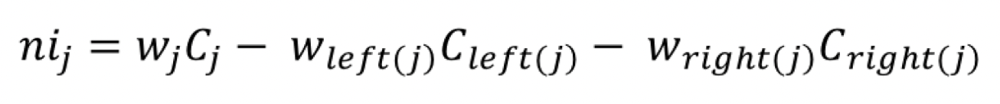

# Comparison of Locally Weighted Regression and Random Forest

### Locally Weighted Regression 

Locally Weighted Regression is a specialized type of linear regression which utilized weighted linear regression to make better predictions. LOWESS is non-parametric. LOESS calculates a predicted regression line by isolating neighboring points within a specified range and calculate an estimate.

In order to find the k nearest neighbors from x, Euclidean distance is used. The distance calculated is then used to find the weights for the regression. In the code section below, this particular Python code can be found within the tricubic() function. The way in which weighting works is by giving more meaning to points closer to the x value will be given a greater weight. For example - a point with zero distance will be given a weight of one. 

The equation for the redictions we make is:


In conclusion, the predictions we make are a linear combination of the actual observed values of the dependent variable and by usinglocally weighted regression we obtained the predicted y as a different linear combination of the values of y.


### Random Forest 

Random Forest Regression is an ensemble learning algorithm that utilizes decision trees. Random Forest works fitting random subsets of the data onto decision tree. The average of their predictions are then computed.isions 

The importance of each node on each decision tree is caluclated. This done by Gini Importance. The following equation assumes that we are using a binary tree with only two child nodes.




This [Towards Data Science Article](https://towardsdatascience.com/the-mathematics-of-decision-trees-random-forest-and-feature-importance-in-scikit-learn-and-spark-f2861df67e3) is a good resource. 

  


## Application of Locally Weighted Regression and Random Forest on Datasets

### Funtions and Code used for Both Datasets 

Import the necessary libraries and assign StandardScaler() as scale.
```Python
import numpy as np
import pandas as pd
from scipy import linalg
import matplotlib.pyplot as plt
from scipy.interpolate import interp1d
from sklearn.ensemble import RandomForestRegressor
from sklearn.model_selection import KFold, train_test_split as tts
from sklearn.metrics import mean_squared_error as mse
from sklearn.preprocessing import StandardScaler
scale = StandardScaler()
```

Import datasets that will be used in this analysis.
```Python
from sklearn.datasets import load_diabetes
from sklearn.datasets import load_breast_cancer
```

Distance Function:
```Python
def tricubic(x):
  if len(x.shape) == 1:
    x = x.reshape(-1,1)
  d = np.sqrt(np.sum(x**2,axis=1))
  return np.where(d>1,0,70/81*(1-d**3)**3)
```

LOESS Regression Function:
```Python
def lowess_reg(x, y, xnew, kern, tau):
    n = len(x)
    yest = np.zeros(n)
        
    w = np.array([kern((x - x[i])/(2*tau)) for i in range(n)])     
    
    for i in range(n):
        weights = w[:, i]
        b = np.array([np.sum(weights * y), np.sum(weights * y * x)])
        A = np.array([[np.sum(weights), np.sum(weights * x)],
                    [np.sum(weights * x), np.sum(weights * x * x)]])
        theta, res, rnk, s = linalg.lstsq(A, b)
        yest[i] = theta[0] + theta[1] * x[i] 
    f = interp1d(x, yest,fill_value='extrapolate')
    return f(xnew)
```

Calculate MSE for both Random Forest and Locally Weighted Regression. A four loop was created to determine the optimal tau value. 
```Python
mse_lwr = []
mse_rf = []
rf = RandomForestRegressor(n_estimators=150,max_depth=3)
kf = KFold(n_splits=10,shuffle=True,random_state=1234)
for i in [0.1,0.2,0.3,0.4,0.5,0.6,0.7,0.8,0.9]:
  for idxtrain,idxtest in kf.split(x):
    ytrain = y[idxtrain]
    xtrain = x[idxtrain]
    xtrain = scale.fit_transform(xtrain.reshape(-1,1))
    ytest = y[idxtest]
    xtest = x[idxtest]
    xtest = scale.transform(xtest.reshape(-1,1))
    yhat_lwr = lowess_reg(xtrain.ravel(),ytrain,xtest.ravel(),tricubic,i)
    rf.fit(xtrain,ytrain)
    yhat_rf = rf.predict(xtest)
    mse_lwr.append(mse(ytest,yhat_lwr))
    mse_rf.append(mse(ytest,yhat_rf))
  print(i)
  print('The MSE for Random Forest is :' + str(np.mean(mse_rf)))
  print('The MSE for Locally Weighted Regression is :' + str(np.mean(mse_lwr)))
```

### Dataset 1: Diabetes

MSE for each method and which has better results 
final results 

Assign the data to a variable and make it into a Pandas dataframe.
```Python
data = load_diabetes()
df = pd.DataFrame(data= np.c_[data['data'], data['target']],
                     columns= data['feature_names'] + ['output'])       
```

Assign the input and output variables to x and y.
```Python
x = df['bmi'].values
y = df['output'].values
```
#### Conclusion:
The minimum mean squared error for Random Forest was found with a tau value of 0.5. 
The MSE for Random Forest is :4118.411965779483
The MSE for Locally Weighted Regression is :4031.8434939716976

The minimum mean squared error for Locally Weighted Regression was found with a tau value of 0.9.
The MSE for Random Forest is :4121.596803399811
The MSE for Locally Weighted Regression is :3991.3441318147006


### Dataset 2: Breast Cancer

MSE for each method and which has better results 
final results 

Assign the data to a variable and make it into a Pandas dataframe.
```Python
from sklearn.datasets import load_breast_cancer
data = load_breast_cancer()

df = pd.DataFrame(data= np.c_[data['data'], data['target']],
                     columns= list(data.feature_names) + ['output'])
```

Assign the input and output variables to x and y.
```Python
x = df['mean radius'].values
y = df['output'].values
```

#### Conclusion:
The minimum mean squared error for both Locally Weighted Regression and Random Forest were found with a tau value of 0.1. 
The MSE for Random Forest is :0.09312817955310984
The MSE for Locally Weighted Regression is :0.09020271929160795
