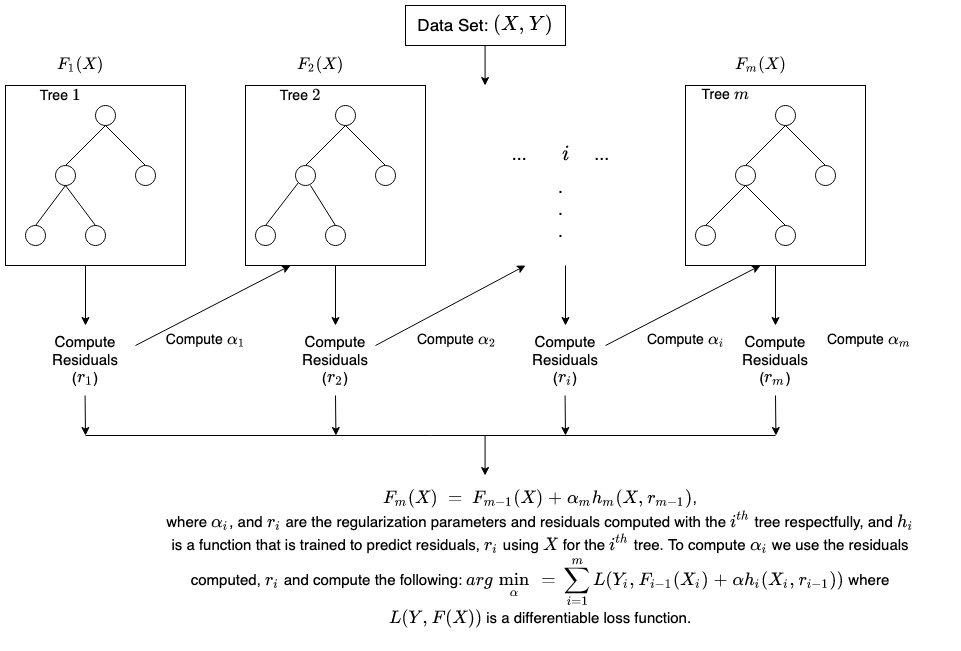

# Advanced Applied Machine Learning Final Assignment

## Economics Background 
Crime and its effect on economic activity and migration have been the center of many economic research investigations. The data analysis conducted in this project sets a foundation that can be expanded to train models that will be able to predict a state or area's crime rate based on a given set of economic factors. Given national data, the crime rate of specific areas cannot be determined because of the unique make-up of each area. However, using state-specific data, we can inform the model with area-specific data and more accurately predict crime rates. Through the use of Neural Networks, a high accuracy model was constructed. This model, with more data, could be applied with smaller granularity to county-level predictions. Accurately predicting crime rates can help inform public policy and individual decisions. If politicians and local leaders know what factors heavily influence crime, they can direct money into correcting those issues. Individuals and families are likely to choose their area of residence based on important factors such as crime which influences their safety. 


## Data 
This [dataset](https://www.kaggle.com/datasets/wenhsuanliang/crime-economic-factors-datasets) was accessed and downloaded from Kaggle and consists of 50 observations. It contains information from the following 10 variables: State Name, Homicide Rate, Gini Index, Unemployment Rate (%), Income Per Capita (USD), Population, Population Density (Population/Mile^2), Spending on Education (USD), Poverty Rate (%), and Urban Population. This is an economic dataset containing information from 2018. What information is represented by each variable is clear in every variable except for the Gini Index. In machine learning, the Gini index indicates the probability that a new random data point will be misclassified if it were randomly assigned a class label according to the dataset distribution. In economics, the Gini Index is a measure of the income distribution across a given population. It is helpful in economic analysis because it acts as an indicator of economic inequality.


## Methodology 

### Locally Weighted Regression
Locally Weighted Regression is a specialized type of regression which utilizes weighted linear regression to make more accurate predictions. It uses supervised learning to compute the relationships between non-linear inputs (x) and outputs (y). LO(W)ESS or LOESS is non-parametric. LOESS calculates a predicted regression line by isolating neighboring points within a specified range and calculate an estimate.

In order to find the k nearest neighbors from x, Euclidean distance is used. The distance calculated is then utilized to find the weights for the regression. In the code section below, the execution of this can be found within the tricubic() function. In this process, weighting works by giving more meaning and greater weight the closer a point is to the x value. For example - a point with zero distance will be given a weight of one. 

The equation for the predictions we make is:


In conclusion, the predictions we make are a linear combination of the actual observed values of the dependent variable and by using locally weighted regression we obtained the predicted y as a different linear combination of the values of y.

### Locally Weighted Regression Boosted (Boosted by both Decision Tree and Random Forest )
The boosting process for locally weighted regressions allows for t
For a locally weighted regressor, F, and the observation x_i, we are able to predict F(x_i). For boosted regressions, F is always considered a weak learner so we train an additional model (h) so the new output becomes yi – F(x_i) and it is likely that the new regressor, F + H, is better than F. 

### Decision Tree
Decision trees are the basis of Random Forest Regressors. It is based on a tree structure that utilizes training data to make predictions. Decision trees form a decision path that is followed. This is a recursive process in which the trees separate into homogenous nodes as they follow the decision path until it reaches the terminal node. The image below shows the generic structure of a decision tree.

[Source](https://scikit-learn.org/stable/auto_examples/tree/plot_unveil_tree_structure.html)

### Random Forest 
Random Forest Regression is an ensemble learning algorithm that utilizes decision trees. Random Forest works by fitting random subsets of the data onto decision trees. The average of the decision tree predictions are then computed. Random forest is non-parametric and is especially useful because it can handle non-linear data. While random forests utilize decision trees, they are an ensemble learning algorithm and more effective because they reduce the chance of overfitting.

In order to calculate the decision tree value, the importance of each node on each decision tree is calculated. This is done through the use of Gini Importance. The Gini index indicates the probability that a new random data point will be misclassified if it were randomly assigned a class label according to the dataset distribution. The following equation assumes that we are using a binary tree with only two child nodes.


This equation shows the feature importance for the Random Forest:


### XGBoost
The purpose of gradient boosting, and more specifically extreme gradient boosting is to strengthen weak learners. Extreme gradient boosting is an improved version of the original gradient boosting model because it includes regularization to prevent overfitting. It works by training multiple iterations of a model over time in a tree-based format. With each iteration of the previous model improved upon. It uses the mean from the dataset and adds the predicted residuals from a decision tree in the forest. XGBoost is known for its speed and ability to outperform other regressors. Below is a visualization to help understand XGBoost.




[Source](https://docs.aws.amazon.com/sagemaker/latest/dg/xgboost-HowItWorks.html)


### Neural Network

Neural networks are a learning system that was modeled after the way human neurons function to understand inputs from our senses. Neural networks work to recognize patterns in the data to give us a useful output. A neural network has three main parts: the input layer, the hidden layer, and the output layer. The input layer takes the data as input nodes and communicates with the hidden layer. Each input is associated with a weight that will influence the importance of the neuron by multiplying the weight by the input. When the model first initiates, the weights are often random. Every neuron has an activation function which allows for non-linear modeling of the network. A training set of input values are run through the network so the prediction can be calculated. These predictions are then compared against the known output values and a loss is calculated. Backpropagation propagation is then used to propagate the loss function so that the model parameters can be optimized. The results of this propagation are then used to update the neural network through the use of gradient descent. This minimizes the loss and creates a better model. These steps are then repeated until a sufficient model is created. 


[Source](https://torres.ai/)


## Coding Applications 

### Import Libraries
``` Python
# general imports
# some libraries
import numpy as np
import pandas as pd
from scipy.linalg import lstsq
from scipy.sparse.linalg import lsmr
import matplotlib.pyplot as plt
from scipy.interpolate import interp1d, griddata, LinearNDInterpolator, NearestNDInterpolator
from sklearn.ensemble import RandomForestRegressor
from sklearn.model_selection import KFold, train_test_split as tts
from sklearn.metrics import mean_squared_error as mse
from sklearn.preprocessing import StandardScaler
from sklearn.tree import DecisionTreeRegressor
from sklearn.linear_model import LinearRegression, Lasso, Ridge, ElasticNet
from statsmodels.nonparametric.kernel_regression import KernelReg
import lightgbm as lgb
from matplotlib import pyplot
import keras
from keras.models import Sequential
from keras.layers import Dense
from keras.layers import Dropout
from sklearn.metrics import r2_score
from tensorflow.keras.optimizers import Adam, SGD, RMSprop 
from keras.callbacks import EarlyStopping
import xgboost as xgb
```

### Read in Data
``` Python
df = pd.read_csv('/content/drive/MyDrive/AML/data/Crime  Ecomonic Factors Datasets.csv')

x = df.loc[:,'Gini_Index':'Urban_Population (%)'].values
y = df['Homicide_Rate'].values
```

### Define Functions Used in Analysis
``` Python
# Tricubic Kernel
def Tricubic(x):
  if len(x.shape) == 1:
    x = x.reshape(-1,1)
  d = np.sqrt(np.sum(x**2,axis=1))
  return np.where(d>1,0,70/81*(1-d**3)**3)

# Epanechnikov Kernel
def Epanechnikov(x):
  if len(x.shape) == 1:
    x = x.reshape(-1,1)
  d = np.sqrt(np.sum(x**2,axis=1))
  return np.where(d>1,0,3/4*(1-d**2)) 

#Defining the kernel local regression model

def lw_reg(X, y, xnew, kern, tau, intercept):
    # tau is called bandwidth K((x-x[i])/(2*tau))
    n = len(X) # the number of observations
    yest = np.zeros(n)

    if len(y.shape)==1: # here we make column vectors
      y = y.reshape(-1,1)

    if len(X.shape)==1:
      X = X.reshape(-1,1)
    
    if intercept:
      X1 = np.column_stack([np.ones((len(X),1)),X])
    else:
      X1 = X

    w = np.array([kern((X - X[i])/(2*tau)) for i in range(n)]) # here we compute n vectors of weights

    #Looping through all X-points
    for i in range(n):          
        W = np.diag(w[:,i])
        b = np.transpose(X1).dot(W).dot(y)
        A = np.transpose(X1).dot(W).dot(X1)
        #A = A + 0.001*np.eye(X1.shape[1]) # if we want L2 regularization
        #theta = linalg.solve(A, b) # A*theta = b
        beta, res, rnk, s = lstsq(A, b)
        yest[i] = np.dot(X1[i],beta)
    if X.shape[1]==1:
      f = interp1d(X.flatten(),yest,fill_value='extrapolate')
    else:
      f = LinearNDInterpolator(X, yest)
    output = f(xnew) # the output may have NaN's where the data points from xnew are outside the convex hull of X
    if sum(np.isnan(output))>0:
      g = NearestNDInterpolator(X,y.ravel()) 
      # output[np.isnan(output)] = g(X[np.isnan(output)])
      output[np.isnan(output)] = g(xnew[np.isnan(output)])
    return output
    

def boosted_lwr_rf(X, y, xnew, kern, tau, intercept):
  # we need decision trees
  # for training the boosted method we use X and y
  Fx = lw_reg(X,y,X,kern,tau,intercept) # we need this for training the Decision Tree
  # Now train the Decision Tree on y_i - F(x_i)
  new_y = y - Fx
  #model = DecisionTreeRegressor(max_depth=2, random_state=123)
  model = RandomForestRegressor(n_estimators=100,max_depth=2)
  #model = model_xgb
  model.fit(X,new_y)
  output = model.predict(xnew) + lw_reg(X,y,xnew,kern,tau,intercept)
  return output 

def boosted_lwr_dt(X, y, xnew, kern, tau, intercept):
  Fx = lw_reg(X,y,X,kern,tau,intercept) # we need this for training the Decision Tree
  new_y = y - Fx
  tree_model = DecisionTreeRegressor(max_depth=2, random_state=123)
  tree_model.fit(X,new_y)
  output = tree_model.predict(xnew) + lw_reg(X,y,xnew,kern,tau,intercept)
  return output 
```

### Conduct the Analysis

``` Python
kf = KFold(n_splits = 10, shuffle = True, random_state = 1234)
scale = StandardScaler()

# establish Nerual Networks 
model_nn = Sequential()
model_nn.add(Dense(128, activation="relu", input_dim=8))
model_nn.add(Dense(128, activation="relu"))
model_nn.add(Dense(128, activation="relu"))
model_nn.add(Dense(128, activation="relu"))
model_nn.add(Dense(1, activation="linear"))
model_nn.compile(loss='mean_squared_error', optimizer=Adam(learning_rate=1e-2)) # lr=1e-3, decay=1e-3 / 200)
es = EarlyStopping(monitor='val_loss', mode='min', verbose=1, patience=800)
```

``` Python
mse_lwr = []
mse_blwr_rf = []
mse_blwr_dt = []
mse_rf = []
mse_xgb = []
mse_nn = []
for i in [10]:
  kf = KFold(n_splits=10,shuffle=True,random_state=i)
  for idxtrain, idxtest in kf.split(x):
    xtrain = x[idxtrain]
    ytrain = y[idxtrain]
    ytest = y[idxtest]
    xtest = x[idxtest]
    xtrain = scale.fit_transform(xtrain)
    xtest = scale.transform(xtest)
    data_train = np.concatenate([xtrain,ytrain.reshape(-1,1)],axis=1)
    data_test = np.concatenate([xtest,ytest.reshape(-1,1)],axis=1)
    yhat_lwr = lw_reg(xtrain,ytrain, xtest,Epanechnikov,tau=0.9,intercept=True)
    yhat_blwr_rf = boosted_lwr_rf(xtrain,ytrain, xtest,Epanechnikov,tau=0.9,intercept=True)
    yhat_blwr_dt = boosted_lwr_dt(xtrain,ytrain, xtest,Epanechnikov,tau=0.9,intercept=True)
    model_rf = RandomForestRegressor(n_estimators=100,max_depth=3)
    model_rf.fit(xtrain,ytrain)
    yhat_rf = model_rf.predict(xtest)
    model_xgb = xgb.XGBRegressor(objective ='reg:squarederror',n_estimators=100,reg_lambda=20,alpha=1,gamma=10,max_depth=3)
    model_xgb.fit(xtrain,ytrain)
    yhat_xgb = model_xgb.predict(xtest)
    model_nn.fit(xtrain,ytrain,validation_split=0.2, epochs=500, batch_size=10, verbose=0, callbacks=[es])
    yhat_nn = model_nn.predict(xtest)
    mse_lwr.append(mse(ytest,yhat_lwr))
    mse_blwr_rf.append(mse(ytest,yhat_blwr_rf))
    mse_blwr_dt.append(mse(ytest,yhat_blwr_dt))
    mse_rf.append(mse(ytest,yhat_rf))
    mse_xgb.append(mse(ytest,yhat_xgb))
    mse_nn.append(mse(ytest,yhat_nn))
print('The cross-validated Mean Squared Error for: ')
print('LWR = ' + str(np.mean(mse_lwr)))
print('BLWR Random Forest = ' + str(np.mean(mse_blwr_rf)))
print('BLWR Decision Tree = ' + str(np.mean(mse_blwr_dt)))
print('RF = ' + str(np.mean(mse_rf)))
print('XGB = ' + str(np.mean(mse_xgb)))
print('NN = ' + str(np.mean(mse_nn)))
```
The cross-validated Mean Squared Error for: 

LWR = 4.037200980140024

BLWR Random Forest = 3.997431350607031

BLWR Decision Tree = 4.005014642729419

RF = 4.4181823129054205

XGB = 4.929575394796289

NN = 3.1709550822808104

``` Python
# LightGBM

# Import additional libraries
from sklearn.model_selection import train_test_split
from sklearn.metrics import mean_squared_error,roc_auc_score,precision_score
import warnings


# scale the data
scale =StandardScaler()
xtrain,xtest,ytrain,ytest = train_test_split(x,y,test_size=0.3,random_state=1234)
xtrain = scale.fit_transform(xtrain)
xtest = scale.transform(xtest)

with warnings.catch_warnings():
  warnings.simplefilter("ignore")
  # Convert into LGB Dataset Format
  train=lgb.Dataset(xtrain, label=ytrain)
  # Set the parameters 
  params={'learning_rate': 0.03, 
          'boosting_type':'gbdt', #GradientBoostingDecisionTree
          'objective':'regression',#regression task
          'n_estimators':100,
          'max_depth':10}
  # Create and train the model
  clf=lgb.train(params, train,100)
  # model prediction 
  ypred=clf.predict(xtest)
  # MSE 
  print('Mean Squared Error = ' + str(mean_squared_error(ypred,ytest)))

  print(mean_squared_error(ypred,ytest))
```
4.695227149101829


### Conclusion

The Neural Network had the best cross-validated Mean Squared Error at 3.17.
