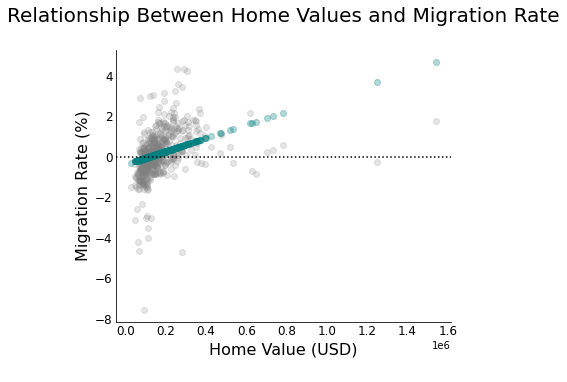
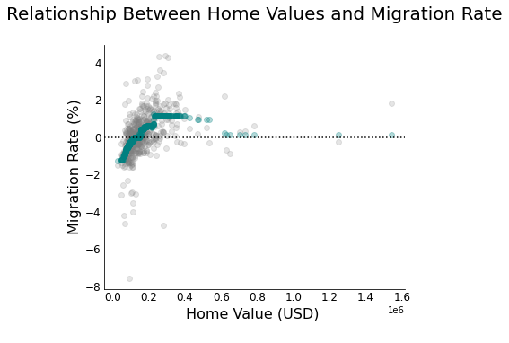

```Python 
import pandas as pd
import numpy as np
from sklearn.model_selection import train_test_split, KFold
from sklearn.metrics import mean_squared_error
from sklearn.preprocessing import StandardScaler 
import matplotlib.pyplot as plt
from sklearn.linear_model import LinearRegression
from sklearn.ensemble import RandomForestRegressor
from lightgbm import LGBMRegressor
import warnings
import seaborn as sns
from sklearn.metrics import mean_squared_error as mse
```

```Python 
df = pd.read_csv('/content/drive/MyDrive/Thesis/data/FINAL_DATA (1).csv')
# stable economy - limit to 2019
df = df[df['year'] == 2019] 

# set variables 
x = df['home_value'].values.reshape(-1, 1)
y = df['migration_rate'].values

X_train, X_test, y_train, y_test = train_test_split(x, y, test_size = 0.2, random_state = 100)
```

```Python 
# Linear Regression
linear_reg = LinearRegression().fit(X_train, y_train)
y_pred_lr = linear_reg.predict(X_test)
mse_lr = mse(y_test, y_pred_lr)
print(f'Linear Regression Mean squared error: {mse_lr:.3}\n')

# Lightgbm
lgbm_model = LGBMRegressor().fit(X_train, y_train)
y_pred_lgbm = lgbm_model.predict(X_test)
mse_lgbm = mse(y_test, y_pred_lgbm)
print(f'LightGBM Mean Squared Error: {mse_lgbm:.3}\n')

# Random Forest 
rf_model = RandomForestRegressor(n_estimators=100,max_depth=3).fit(X_train,y_train)
y_pred_rf = rf_model.predict(X_test)
mse_rf = mse(y_test, y_pred_rf)
print(f'Random Forest Mean Squared Error = {mse_rf:.3}\n')
```
Linear Regression Mean squared error: 1.2

LightGBM Mean Squared Error: 0.981

Random Forest Mean Squared Error = 0.966

```Python 
training_score = linear_reg.score(X_train, y_train)*100
test_score = linear_reg.score(X_test, y_test)*100
print(f'Linear Regression Train Model Score = {training_score:.3}%')
print(f'Linear Regression Test Model Score = {test_score:.3}% \n')

training_score = rf_model.score(X_train, y_train)*100
test_score = rf_model.score(X_test, y_test)*100
print(f'Random Forest Train Model Score = {training_score:.3}%')
print(f'Random Forest Test Model Score = {test_score:.3}%')
```

Linear Regression Train Model Score = 10.7%
Linear Regression Test Model Score = 10.6% 

Random Forest Train Model Score = 29.2%
Random Forest Test Model Score = 28.0%


```Python
housing = X_test 
migration = y_pred_lr
# initiate the figure
plt.figure(figsize=(6,5))
plt.scatter(X_test, y_test, color = 'grey', alpha = 0.2)
plt.scatter(housing, migration, color = 'teal', alpha = 0.3)
# clean up the visual
plt.axhline(0, color = 'black', linestyle = 'dotted')   
plt.gca().spines['top'].set_visible(False)  
plt.gca().spines['right'].set_visible(False)
plt.tick_params(axis='both', labelsize=12, length = 0)    
plt.xlabel("Home Value (USD)\n", fontsize = 16)   
plt.ylabel("\nMigration Rate (%)", fontsize = 16)    
plt.title('Relationship Between Home Values and Migration Rate\n', fontsize = 20)    
plt.show()
# plt.savefig('./images/scatterplot.png')


housing = X_test 
migration = y_pred_rf
# initiate the figure
plt.figure(figsize=(6,5))
plt.scatter(X_test, y_test, color = 'grey', alpha = 0.2)
plt.scatter(housing, migration, color = 'teal', alpha = 0.3)
# clean up the visual
plt.axhline(0, color = 'black', linestyle = 'dotted')   
plt.gca().spines['top'].set_visible(False)  
plt.gca().spines['right'].set_visible(False)
plt.tick_params(axis='both', labelsize=12, length = 0)    
plt.xlabel("Home Value (USD) \n", fontsize = 16)   
plt.ylabel("\nMigration Rate (%)", fontsize = 16)    
plt.title('Relationship Between Home Values and Migration Rate\n', fontsize = 20)   
plt.show()
# plt.savefig('./images/scatterplot.png')
```




